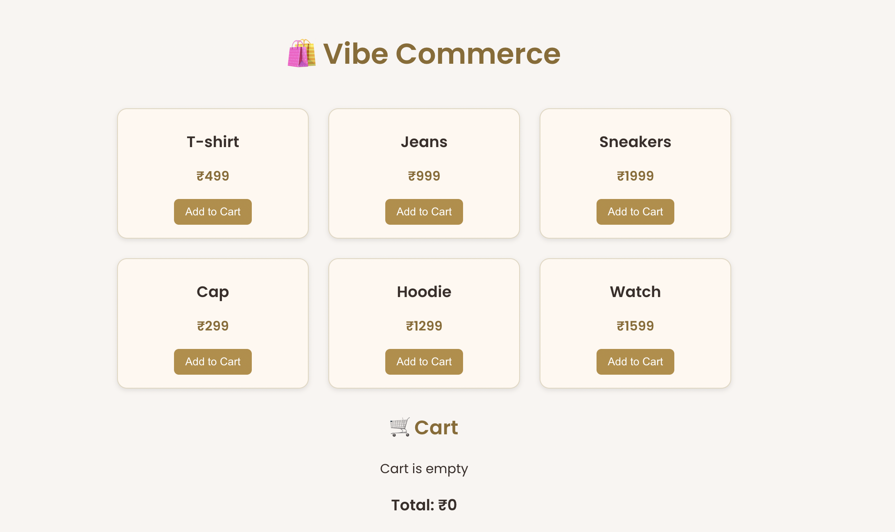
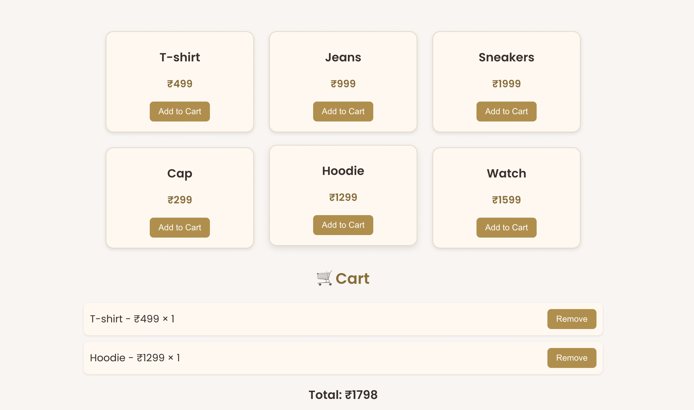
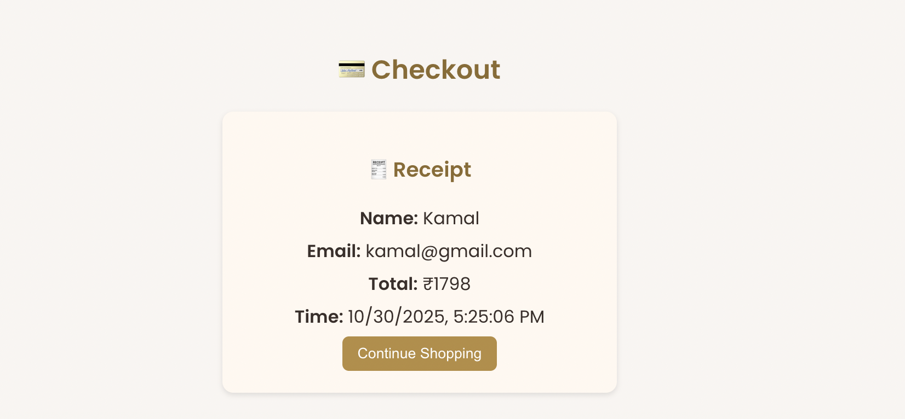

# 🛍️ Vibe Commerce

A full-stack **e-commerce web application** built with the MERN stack (MongoDB, Express, React, Node.js).  
Users can browse products, add items to cart, and checkout securely.

---

## 🚀 Features
- 🔐 User authentication (JWT)
- 🛒 Add / remove products from cart
- 💳 Checkout flow with order summary
- 🗄️ MongoDB-based backend with Express API
- 🎨 Modern React frontend with Axios and Context API

---

## 🧩 Tech Stack
| Layer | Technology |
|-------|-------------|
| Frontend | React.js, Axios, Tailwind CSS / CSS |
| Backend | Node.js, Express.js |
| Database | MongoDB (Mongoose) |
| Version Control | Git & GitHub |

---

## 🖼️ Screenshots

### 🏠 Home Page


### 🛒 Cart Page


### 💳 Checkout Page


## ⚙️ Setup Instructions

### 🧱 1. Clone the repository
```bash
git clone https://github.com/kamal-260603/ecom.git
cd ecom
